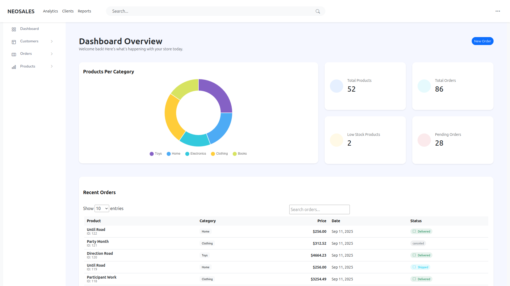

# 🛒 Neosales E-Commerce Project

This is a **Django-based e-commerce web application** with features for managing products, customers, and orders. The project is designed to demonstrate a e-commerce workflow, including authentication, CRUD operations, and an admin-friendly dashboard with modern UI components.



---

## 📂 Project Structure

.<br>
├── ecommerce/ # Main Django project settings and configs <br>
├── store/ # Store app: models, views, forms, and URLs<br>
├── templates/ # HTML templates for pages and partials<br>
├── static/ # CSS, JS, images, fonts, and vendor assets<br>
├── db.sqlite3 # SQLite database<br>
├── data_seed.py # Script to seed initial data<br>
├── manage.py # Django management CLI<br>
└── README.md # Project documentation<br>


---

## 🚀 Features

- **Product Management**: Add, update, delete, and view product listings.  
- **Customer Management**: Register customers, view details, and manage records.  
- **Order Management**: Track and update order statuses.  
- **Authentication**: User login and registration. 
- **Admin Dashboard**: Styled UI with charts, tables, and forms.  
- **Responsive UI**: Built with SCSS, Bootstrap, and vendor libraries.  
- **Seed Data**: Preload sample products and customers using `data_seed.py`.  

---

## 🛠️ Installation & Setup

### 1. Clone the Repository
```bash
git clone https://github.com/Maikoandre/neosales.git
cd django-ecommerce
```

### 2. Create and Activate a Virtual Environment
```bash
python3 -m venv venv
source venv/bin/activate   # For Linux/macOS
venv\Scripts\activate      # For Windows
```

### 3. Install Dependencies
```bash
pip install django
```

### 4. Run Database Migrations
```bash
python3 manage.py migrate
```
### 5. Seed the Database (Optional)
```bash
python3 data_seed.py
```

### 6. Run Development Server
```bash
python3 manage.py runserver
```

## 🧑‍💻 Tech Stack

- **Backend**: Django (Python)

- **Frontend**: HTML, SCSS, Bootstrap, JS

- **Database**: SQLite (default, but easily swappable to PostgreSQL/MySQL)

- **Task Runner**: Gulp (for static asset management)

